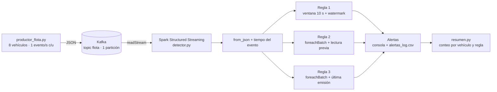

<div align="center">

# Detección de Anomalías en Flota de Vehículos en Tiempo Real

**Pipeline de streaming con Apache Kafka y Spark Structured Streaming: ventanas de tiempo, estado y reglas de alerta**

🎓 Proyecto académico — Big Data, Universidad EIA (2026-2)

[](https://www.python.org/)
[](https://kafka.apache.org/)
[](https://spark.apache.org/streaming/)
[](https://www.docker.com/)
[](#licencia)

</div>

---

## Tabla de contenido

- [Descripción general](#descripción-general)
- [Los eventos](#los-eventos)
- [Arquitectura del pipeline](#arquitectura-del-pipeline)
- [Reglas de detección](#reglas-de-detección)
  - [Regla 1. Exceso de velocidad sostenido](#regla-1-exceso-de-velocidad-sostenido)
  - [Regla 2. Caída anómala de combustible](#regla-2-caída-anómala-de-combustible)
  - [Regla 3. Vehículo en silencio](#regla-3-vehículo-en-silencio)
- [Resultados](#resultados)
- [Interpretación de negocio](#interpretación-de-negocio)
- [Decisiones de diseño](#decisiones-de-diseño)
- [Estructura del repositorio](#estructura-del-repositorio)
- [Tecnologías utilizadas](#tecnologías-utilizadas)
- [Instalación y uso](#instalación-y-uso)
- [Contraste con los entregables anteriores](#contraste-con-los-entregables-anteriores)
- [Aprendizajes clave](#aprendizajes-clave)
- [Contexto académico](#contexto-académico)
- [Licencia](#licencia)
- [Autores](#autores)

---

## Descripción general

Sistema de **monitoreo de flota en tiempo real** para una empresa de logística. Cada vehículo emite telemetría de forma continua (velocidad, combustible y posición) hacia un *topic* de **Apache Kafka**; un detector construido con **Spark Structured Streaming** consume ese flujo, parsea los eventos JSON y aplica tres reglas de negocio que generan alertas al instante:

1. **Exceso de velocidad sostenido** (agregación con ventana de tiempo).
2. **Caída anómala de combustible** (comparación con la lectura anterior del mismo vehículo).
3. **Vehículo en silencio** (seguimiento de la última emisión de cada vehículo).

Todo el entorno (Kafka y Spark) corre en **Docker** sobre la misma máquina, y cada alerta se imprime en consola y se registra en un CSV como evidencia verificable de la corrida.

## Los eventos

El productor (entregado por la asignatura, sin modificar) emite al topic `flota` un evento por vehículo cada segundo:

| Campo | Significado | Ejemplo |
|---|---|---|
| `id_vehiculo` | Identificador del vehículo (`V01` a `V08`) | `V03` |
| `velocidad` | Velocidad en km/h | `127` |
| `combustible` | Nivel de combustible (0 a 100) | `78.4` |
| `lat`, `lon` | Posición geográfica | `6.24112`, `-75.58340` |

El flujo trae **patrones sembrados** que sirven como verdad de referencia para validar el detector:

| Vehículo | Patrón sembrado | Regla que debería dispararse |
|---|---|---|
| `V03` | Velocidad de 115 a 140 km/h en una racha de 16 lecturas por ciclo | Regla 1 |
| `V05` | Consumo de 2,5 a 4,0 puntos por lectura (normal: 0,05 a 0,2) | Regla 2 |
| `V07` | Deja de emitir en un instante aleatorio entre el segundo 60 y el 90 | Regla 3 |

## Arquitectura del pipeline



Kafka y Spark corren en contenedores de la misma red de Docker. El productor, que corre en la máquina anfitriona, se conecta por `localhost:9092`; Spark se conecta por el listener interno `kafka:29092`.

## Reglas de detección

Parámetros configurables al inicio de `detector.py`:

| Parámetro | Valor | Justificación |
|---|---|---|
| `UMBRAL_VELOCIDAD` | 100 km/h | Límite a partir del cual se considera exceso |
| `MIN_LECTURAS` | 3 | Distingue un exceso sostenido de un pico aislado |
| `VENTANA` | 10 s | El productor emite 1 lectura/s por vehículo: una ventana de 10 s contiene ~10 lecturas |
| `WATERMARK` | 20 s | Tolerancia a datos tardíos; permite a Spark liberar estado |
| `UMBRAL_CAIDA` | 1,0 puntos | Muy por encima del consumo normal (≤ 0,3 con redondeo) y por debajo del anómalo (2,5 a 4,0) |
| `SILENCIO_SEG` | 10 s | Tiempo sin emitir para declarar a un vehículo en silencio |
| Trigger | 2 s | Frecuencia de los micro-lotes |

### Regla 1. Exceso de velocidad sostenido
*Agregación con ventana de tiempo nativa de Spark*

Se filtran las lecturas con `velocidad > 100`, se agrupan por ventana de 10 segundos y vehículo con `window()` + `withWatermark()`, y se alerta cuando el conteo llega a 3 o más. Usa `outputMode("update")` y un conjunto de ventanas ya alertadas para no repetir la alerta cada vez que el conteo crece.

### Regla 2. Caída anómala de combustible
*`foreachBatch` con estado en el driver*

Spark no permite comparar cada fila con la anterior (`lag`) directamente sobre un stream, así que cada micro-lote se procesa como DataFrame normal con `foreachBatch`, ordenado por `offset`, y se mantiene un diccionario con el último nivel de combustible de cada vehículo. Se alerta cuando la caída entre dos lecturas consecutivas es de **1,0 o más**; las caídas negativas (el productor rellena el tanque a 100) se ignoran.

### Regla 3. Vehículo en silencio
*`foreachBatch` con estado: última emisión por vehículo*

Se guarda el timestamp del último evento de cada vehículo y se compara contra el "reloj del stream" (el timestamp más reciente visto en cualquier vehículo). Si la diferencia supera los 10 s, se alerta **una sola vez**; si el vehículo vuelve a emitir, se limpia el estado y se registra la recuperación. Usar el reloj del stream en lugar de la hora del sistema evita falsas alarmas por desfases de reloj entre contenedores.

## Resultados

> Resultados de la corrida de validación (≈ 4 minutos). Cifras generadas con `python resumen.py` a partir de `alertas_log.csv`.

| Regla | Vehículo esperado | Alertas detectadas | Primera alerta |
|---|---|---|---|
| Velocidad sostenida | `V03` | XX | HH:MM:SS |
| Caída de combustible | `V05` | XX | HH:MM:SS |
| Vehículo en silencio | `V07` | XX | HH:MM:SS |

**Vehículo con más alertas:** XX (XX alertas en total).

Las capturas del detector alertando en vivo están en la carpeta [`capturas/`](capturas/).

## Interpretación de negocio

**¿Qué haríamos en producción con cada tipo de alerta?**

| Alerta | Acción propuesta |
|---|---|
| Exceso de velocidad sostenido | Notificar al conductor y al despachador en el momento; acumular el historial por conductor para programas de seguridad vial |
| Caída anómala de combustible | Contactar al conductor, verificar la ubicación del vehículo y, si no hay explicación, escalar como posible robo o fuga |
| Vehículo en silencio | Llamar al conductor; si no responde, enviar apoyo a la última posición conocida (`lat`, `lon`) |

**¿El silencio se detecta rápido o tarde?** Por diseño, con un retraso aproximado de **umbral (10 s) más el intervalo del micro-lote (2 s)**: un vehículo no puede declararse en silencio hasta que haya pasado el umbral sin datos. Es un compromiso entre rapidez y falsas alarmas: un umbral más corto detecta antes, pero confunde un retraso de red con una falla real.

## Decisiones de diseño

- **Topic con 1 partición.** Kafka solo garantiza el orden dentro de una partición. La regla 2 compara cada lectura con la anterior del mismo vehículo, y el productor no usa clave; con varias particiones las lecturas de un vehículo llegarían desordenadas y producirían falsos positivos. Con 1 partición, el `offset` es un orden total de llegada.
- **`foreachBatch` para las reglas con estado.** Es la vía que ofrece Spark para operaciones que no soporta directamente en streaming (comparación con la fila anterior, seguimiento de la última emisión). Cada micro-lote llega como DataFrame estático y el estado se mantiene entre lotes.
- **Tiempo del evento = timestamp de Kafka.** El productor no incluye hora en el JSON, así que se usa el `timestamp` que Kafka asigna a cada mensaje.
- **Spark en Docker, en la misma red que Kafka.** Cumple el requisito de que ambos estén en la misma máquina y evita instalar Java y Hadoop en Windows.
- **`spark.sql.shuffle.partitions = 4`.** El valor por defecto (200) es excesivo para este volumen y hace que las agregaciones en streaming tarden demasiado en producir resultados.
- **Alertas persistidas en CSV.** Cada alerta queda registrada con hora, regla, vehículo y detalle, lo que permite auditar la corrida y producir el resumen sin depender de la consola.

**Limitación conocida:** el estado de las reglas 2 y 3 vive en la memoria del driver, por lo que no sobrevive a un reinicio del detector. En producción se usaría estado gestionado por Spark (`applyInPandasWithState`) o un almacén externo como Redis.

## Estructura del repositorio

```
.
├── productor_flota.py          # Fuente de datos (entregada por la asignatura, sin modificar)
├── detector.py                 # Detector con Spark Structured Streaming: las 3 reglas
├── resumen.py                  # Resumen de alertas por regla y vehículo
├── docker-compose.yml          # Kafka (KRaft) + contenedor de Spark
├── alertas_log.csv             # Evidencia: alertas de la corrida de validación
├── capturas/                   # Capturas del detector alertando en vivo
├── Streaming - Trabajo 3 - Sebastián Giraldo Franco y Juan Jose Jaramillo Mora.pdf   # Informe
├── LEEME.txt                   # Instrucciones originales de la asignatura
└── LICENSE
```

## Tecnologías utilizadas

| Categoría | Herramientas |
|---|---|
| Mensajería | Apache Kafka 3.7 (modo KRaft, un nodo) |
| Procesamiento en streaming | Apache Spark 3.5 · PySpark · Structured Streaming |
| Conector | `spark-sql-kafka-0-10` |
| Técnicas de streaming | Ventanas de tiempo, *watermark*, `foreachBatch`, estado entre micro-lotes |
| Infraestructura | Docker y Docker Compose |
| Productor | Python · `kafka-python` |

## Instalación y uso

**Requisitos:** Docker Desktop y Python 3 con `kafka-python` (`pip install kafka-python`).

```powershell
# 1. Levantar Kafka y Spark
docker compose up -d

# 2. Crear el topic (1 partición: orden total de eventos)
docker compose exec kafka /opt/kafka/bin/kafka-topics.sh --create --if-not-exists --topic flota --bootstrap-server localhost:9092 --partitions 1 --replication-factor 1

# 3. Terminal A: lanzar el detector (descarga el conector la primera vez)
docker compose exec spark /opt/spark/bin/spark-submit --master "local[4]" --packages org.apache.spark:spark-sql-kafka-0-10_2.12:3.5.3 /app/detector.py

# 4. Terminal B: lanzar el productor (cuando el detector muestre "ACTIVO")
python productor_flota.py

# 5. Al terminar (Ctrl+C en ambas terminales), resumir las alertas
python resumen.py
```

El detector debe arrancar **antes** que el productor: el silencio de `V07` ocurre una sola vez por corrida. Para repetir el experimento, se borra `alertas_log.csv` y se reinicia el productor. Para apagar el entorno: `docker compose down`.

## Contraste con los entregables anteriores

Este trabajo cierra una progresión de tres entregas sobre el mismo problema de fondo —transformar datos en decisiones de negocio—, con paradigmas cada vez más cercanos a lo que usa la industria:

| Entregable | Paradigma | Datos |
|---|---|---|
| **Trabajo 1** | MapReduce sobre Hadoop (mappers y reducers a mano, jobs encadenados) | Batch: archivo completo |
| **Trabajo 2** | Spark (DataFrames, Spark SQL, funciones de ventana) | Batch: archivo completo |
| **Trabajo 3** | Kafka + Spark Structured Streaming | **Streaming**: eventos que llegan sin parar |

La diferencia clave es que aquí los datos nunca están completos: el sistema debe decidir con lo que ha visto hasta ahora, lo que obliga a razonar sobre ventanas de tiempo, estado entre micro-lotes y latencia de detección.

## Aprendizajes clave

- Structured Streaming expone la misma API de DataFrames que el procesamiento batch, pero algunas operaciones (como `lag`) no existen sobre un stream; `foreachBatch` es la salida para ese tipo de lógica con estado.
- El orden de los eventos depende de la configuración de Kafka: el número de particiones y la clave de los mensajes determinan qué comparaciones entre lecturas consecutivas son válidas.
- En detección de anomalías, los umbrales son decisiones de negocio con costo: un umbral estricto detecta antes pero genera más falsas alarmas, y uno laxo hace lo contrario.
- Un sistema de alertas no está completo hasta que se pregunta qué se hace con cada alerta: la tecnología detecta, pero la respuesta operativa (llamar, escalar, enviar apoyo) es lo que genera valor.
- Validar contra patrones sembrados (verdad de referencia conocida) permite comprobar que el detector acierta, en lugar de limitarse a mostrar que "emite alertas".

## Contexto académico

Desarrollado como Trabajo 3 (tercera nota) de la asignatura Big Data, Universidad EIA (2026-2), en parejas. El trabajo consistía en construir un pipeline completo de streaming —montaje de Kafka en Docker, detector con Spark Structured Streaming que implementa tres reglas de un caso de negocio, e informe de interpretación— a partir de un productor de eventos entregado por la asignatura.

## Licencia

Este proyecto se distribuye bajo licencia [MIT](LICENSE). Los datos son sintéticos, generados por el productor provisto por la asignatura para fines académicos.

## Autores

**Sebastián Giraldo Franco** — [@sebasgiraldo69](https://github.com/sebasgiraldo69)
**Juan José Jaramillo Mora** — [@Juanjo1414](https://github.com/Juanjo1414)
